# 💫 About Me:
I am Ghani Rehman, a Full Stack Engineer specializing in building scalable, high-performance web and mobile applications. With 4+ years of experience, I work across modern frontend and backend technologies including React, Next.js, Node.js, Express.js, React Native, TypeScript, and MongoDB.  I enjoy solving complex engineering problems and transforming ideas into reliable digital products. My experience includes developing SaaS platforms, e-commerce solutions, marketplace applications, real-time systems, and business management tools with a strong focus on performance, scalability, and user experience.  I have worked with cloud technologies and modern development practices including AWS services, Docker, CI/CD pipelines, Redis, background job processing, and database optimization. I am passionate about writing clean, maintainable code and designing architectures that can grow with business needs.  Beyond coding, I am passionate about exploring new technologies, improving engineering processes, and continuously learning to stay ahead in the fast-moving world of software development.

## 🌐 Socials:
   

#💻 Tech Stack:

# 📊 GitHub Stats:
 
 

---

<!-- Proudly created with GPRM ( https://gprm.itsvg.in ) -->
